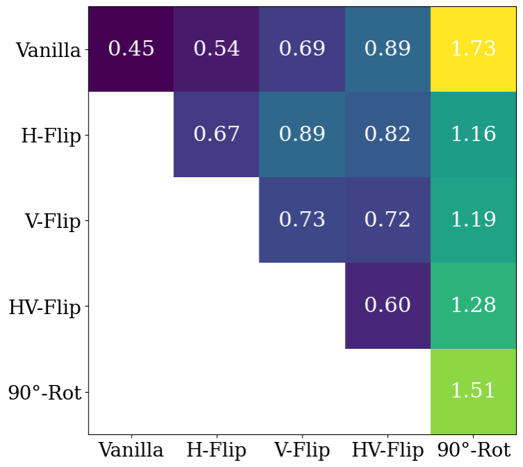

# A Loss Perspective on Symmetric CNN Kernels
The development of Convolutional Neural Networks (CNNs) was the first machine
learning approach that allowed machines to surpass human performance on Ima-
geNet, laying the foundation for modern deep learning. However, little is known
about the use of symmetric kernels within these models. Recent work indicates
that symmetric CNN kernels exhibit good regularization characteristics and sym-
metry seems to emerge naturally throughout training. Our work investigates this
phenomenon from a loss perspective. Our results show that simple symmetric
kernels seem to be more linearly connected to the simple SGD solution than highly
symmetry constrained kernels. Interestingly, these findings also hold when training
on augmented data. This indicates that vanilla CNNs are mechanistically similar to
CNNs using simple symmetric kernels, especially with horizontal symmetry. Fur-
thermore, we find training on augmented data increases the symmetry within CNN
kernels. An investigation of the SGD optimization process shows that SGD paths
are non-linear for highly constrained kernels and tend to find flatter minima. These
findings indicate that solutions for more constrained symmetries are harder to find
but might also lie in completely different loss valleys and behave mechanistically
differently.




*Figure 1: Visualization of loss barriers between ResNets with different symmetric kernels.*

## Requirements

To install requirements:

```setup
pip install -r requirements_pip.txt
```

### Train a ResNet

To train a ResNet model run:

```experiment1
python main.py --config configs/vanilla_configs/vflip.yaml
```
Choose a config depending on the kernel symmetry you want.
### Linear Mode Connectivity

To calculate the loss along the linear interpolation between two models, run:

```experiment2
python connectivity.py --config configs/vanilla_connectivity/vanilla_1_to_rot90_1_lmcp.yaml
```
You can choose the correct config based on the models you want to interpolate between. 

Consider modifying the data paths in the config or other hyperparameters based on your requirements.

### Sharpness Evaluation

Code to evaluate the sharpness of minima can be found in the `connectivity.ipynb` notebook.

## Results

You can find most of the results of the experiments in the logs folder or on your Weights & Biases.

## Acknowledgements

This project is part of the course "Geometric Deep Learning" at the University of Oxford (HT25).

## Contact

If you have any questions, feel free to contact me at ...
